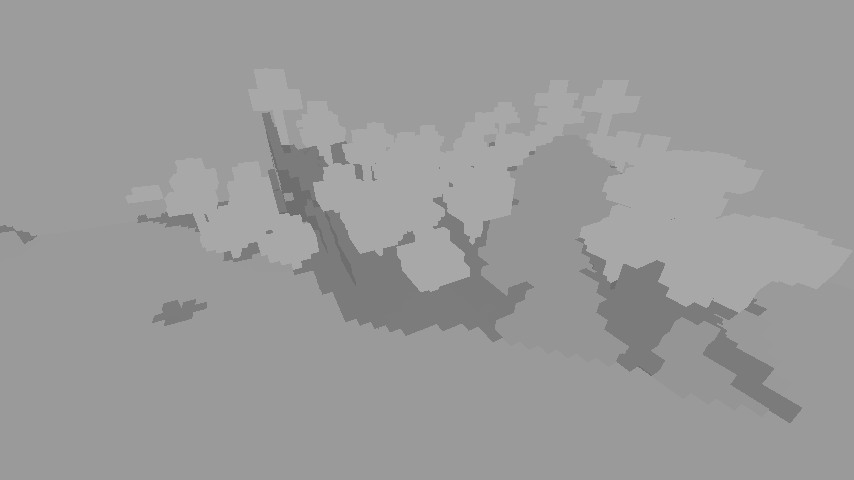
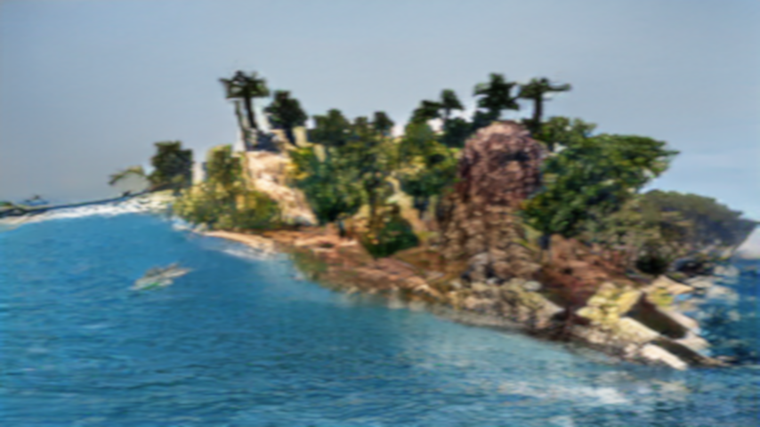
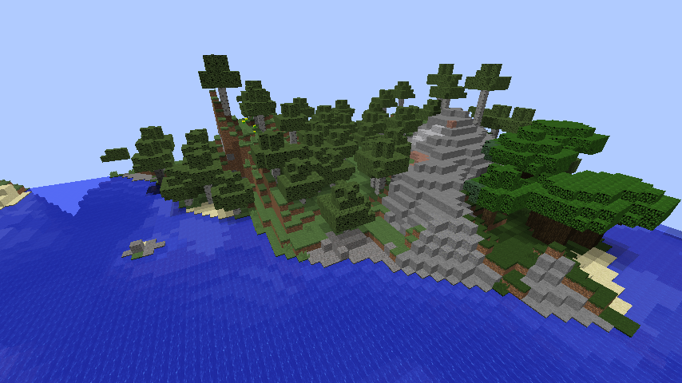
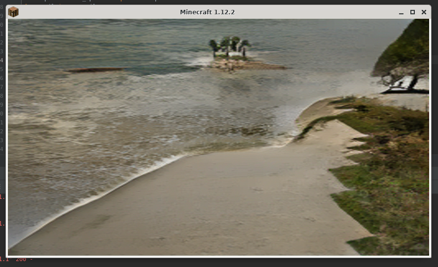

spade_mc
===

What it is?
---

spade_mc is an attempt to combine [Minecraft](https://www.minecraft.net/) and [SPADE](https://github.com/NVlabs/SPADE). Here is the idea:
1. Minecraft renders an image where each pixel marks that there is certain object in this position (like sky, dirt or plant) using one of the hades od grey: 
2. SPADE turns that image into a one that can resemble a photo: 

Here is how the same place looks like in normal Minecraft renderer: 

So basically it is combination of traditional rasterization rendering technique used in combination with AI to render procedurally generated worlds (that you can even manually modify if you want to do so): 

Here is a demo video of how it works in practice: <video src="demo.mp4" style="width: 100%" controls></video>

And a link to some more images and videos: [results.7z](https://yadi.sk/d/1JvIBDh8-zXKhA).

How it works?
---

Minecraft and SPADE communicate using HTTP over TCP/IP. SPADE is modified to include a server. Minecraft is modified with a custom mod and a custom resource pack (that the mod installs automatically) to produce black and white segmentation maps instead of default colorful image made to be perceived by humans. Mods that add more smooth terrain (namely [NoCubes](https://github.com/Cadiboo/NoCubes)) and more natural trees (namely [DynamicTrees](https://github.com/ferreusveritas/DynamicTrees)) can also be installed.

Server side just receives images from POST Multipart requests, processes them and returns the result. It can also handle GET requests for manual image upload from a browser. Images are scaled down to 256x256 before processing and are scale up back to their original resolution afterwards. Standard image formats like PNG and BMP can be used, as well as custom raw image data format that aims to eliminate unnecessary image encoding and decoding steps.

On the client side (Minecraft) features like lighting, shading and clouds are disabled using said [Forge](http://files.minecraftforge.net/) mod and resource pack. [Optifine](https://optifine.net/) is used to make some of the needed changes more easy. Some mods have to be patched to achieve this behavior, so these forks should be used: [NoCubes](https://github.com/afdw/NoCubes), [DynamicTrees](https://github.com/afdw/DynamicTrees). For supported blocks textures that include include only a single solid color and possibly a transparent background were drawn. The mod adds a hook that is executed after the world is rendered; it makes a screenshot, does a synchronous HTTP request to the server, and the renders the resulting image back; than overlays like hotbar and debug screen are drawn. The result is mostly normally operating Minecraft but with its in-world graphics replaced.

How fast is it? Is it really realtime?
---

On the machine on which am writing that (`Intel(R) Core(TM) i9-9900K CPU @ 3.60GHz` and `VGA compatible controller: NVIDIA Corporation TU106 [GeForce RTX 2070 Rev. A]`) framerates range from 10 to 15 FPS. On a laptop on which I have originally developed this project (`Intel(R) Core(TM) i5-2410M CPU @ 2.30GHz` and `VGA compatible controller: Advanced Micro Devices, Inc. [AMD/ATI] Whistler [Radeon HD 6630M/6650M/6750M/7670M/7690M]`) it took multiple minutes to render a single frame (because it was done on the CPU). So you need a compatible GPU for this to work fast enough, and only ones from NVIDIA are currently supported.

Dataset used
---

The [COCO-Stuff Dataset](https://github.com/nightrome/cocostuff) is currently used. I think that the dataset used by NVIDIA in their demos (made from landscape photos) would produce much better result, but sadly I do not have access to it. Suggestions on how to solve this are welcome (can we recreate it ourselves?). But for now, here is how to make more textures for COCO-Stuff Dataset: go to [labels list](https://github.com/nightrome/cocostuff/blob/master/labels.md), find most suitable one and grab its id. The color is the shade of grey that is one less than the id, i.e. `rgb(id - 1, id - 1, id - 1)`.

Setting up the server
---

Download [checkpoints.tar.gz](https://drive.google.com/file/d/12gvlTbMvUcJewQlSEaZdeb2CdOB-b8kQ/view?usp=sharing), then do the following:
```bash
git clone https://github.com/afdw/SPADE
cd SPADE
cd models/networks
git clone https://github.com/vacancy/Synchronized-BatchNorm-PyTorch
cp -rf Synchronized-BatchNorm-PyTorch/sync_batchnorm .
cd ../..
mkdir checkpoints
cd checkpoints
tar xvf ~/Downloads/checkpoints.tar.gz
cd ..
```
Then make sure that you have [NumPy](https://numpy.org/), [PyTorch](https://pytorch.org/), [TorchVision](https://github.com/pytorch/vision), [Dominate](https://github.com/Knio/dominate), [dill](https://pypi.org/project/dill/) and [scikit-image](https://scikit-image.org/) installed and you are ready to start the server:
```bash
python server.py
```
You can also specify the port:
```bash
python server.py --port 1234
```
When it prints the `Server is ready` message, you can open a Web browser like [Firefox](https://www.mozilla.org/en-US/firefox/) and go to [http://localhost:8000/](http://localhost:8000/). You can than upload an image (for example, one at the very begging of this page) and make sure that it produces the expected result. API is very simple: just do a POST request with your image passed as a Multipart field.

Setting up the client
---

Make sure you have Java 8 installed, download [spade_mc_debug_mods_1.zip](https://yadi.sk/d/9LQZ5sKVxBF0jw) (or use your own similar mods), and then do the following:
```bash
git clone https://github.com/afdw/spade_mc_mod
cd spade_mc_mod
mkdir -p run/mods
cd run/mods
upzip ~/Downloads/spade_mc_debug_mods_1.zip
cd ../..
./gradlew setupDecompWorkspace
```
Then you can run
```bash
./gradlew runClient
```
Or, if you wish to run the client on a machine different from one where you are running the server:
```bash
_JAVA_OPTIONS=-Dspade_mc.url=http://rtx.local:8000/ ./gradlew runClient
```
To start the game. After it loads up, you can select `Singleplayer`, `Create New World`, `Game Mode: Creative` and then `Create New World` again. To toggle rendering with SPADE press the grave key (\`) on your keyboard. You can start flying by double tapping `Space` and move around using `Space`, `Shift`, `W`, `A`, `S`, `D`.

Credits
---

What I (afdw, Anton Danilkin) did is just packing it all together. Everything else has be done by authors and developers of projects mentioned here.
